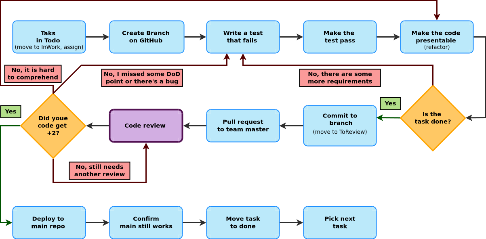
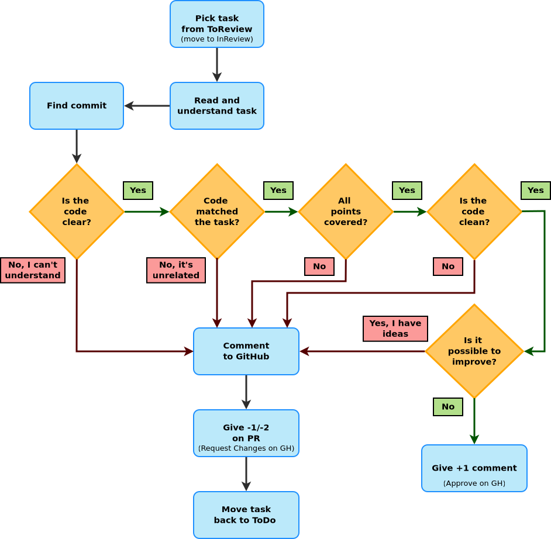

# Munkafolyamat

Definiáltunk egy munkafolyamatot, amely követése elvárás a félév során.
A munkafolyamat alapvetően feltételezi, hogy egy adott kódrészletet egy kolléga ír, de legkevésbé sem tilos a [pair programming](https://en.wikipedia.org/wiki/Pair_programming) sem. Ahhoz, hogy a GitHub rögzítse a mindkét kollégát, a társszerzőt meg kell jelölni. Erről [itt lehet olvasni](git.md#t%C3%A1rsszerz%C5%91k).

A konkrét feladatmegoldáshoz az alábbi folyamat az elvárt:

* User Story:
    * high level description of sprint goal by customer not complete! Never detailed enough!
* Component Design:
    * what will realize the functions in the user story You have to recognize the (hidden?) functionality!
* Requirement Specification:
    * what makes the component work as expected basically the Definition of Done for the component
* Task Definition:
    * add milestone (there is one for every sprint) to issue
    * add assignee to issue
    * add Definition of Done list to issue
    * add project (there is one for every team) to issue
    * [Guide to Splitting User Stories](https://www.humanizingwork.com/the-humanizing-work-guide-to-splitting-user-stories/)

* Dod: Definition of Done

## Code Review in details

* Clean Code:
    * no magic numbers
    * no abbreviations
    * no extreme unit lengths
    * talkative names
    * unambiguous code
* in short:
    * Easy to understand and maintain
    * Reads like well written prose

## Commit üzenetek

A [How to Write a Git Commit Message](https://chris.beams.io/posts/git-commit/) egy hosszabb, példákkal illusztrált írás a jó commit üzenetekről, amely [hét szabályban](https://chris.beams.io/posts/git-commit/#seven-rules) foglalja össze, hogy mire kell figyelni. Ezt egészíteném ki egy nyolcadikkal.

1. [Separate subject from body with a blank line](https://chris.beams.io/posts/git-commit/#separate)
2. [Limit the subject line to 50 characters](https://chris.beams.io/posts/git-commit/#limit-50)
3. [Capitalize the subject line](https://chris.beams.io/posts/git-commit/#capitalize)
4. [Do not end the subject line with a period](https://chris.beams.io/posts/git-commit/#end)
5. [Use the imperative mood in the subject line](https://chris.beams.io/posts/git-commit/#imperative)
6. [Wrap the body at 72 characters](https://chris.beams.io/posts/git-commit/#wrap-72)
    - ez a legkevésbé fontos
7. [Use the body to explain what and why vs. how](https://chris.beams.io/posts/git-commit/#why-not-how)
8. **Reference the issue!**

### Miért fontos a 8. pont?

Valójában (bizonyos szempontból) az issue behivatkozása a legfontosabb, méghozzá a **visszakövethetőség** (traceability) miatt.

Minden módosítás (a verziókövető rendszerben) rendelkezik egy azonosítóval, amelyhez társul, hogy ki és mikor végezte el a módosítást. Valamit egy üzenet, amely -- jó esetben -- leírja, hogy mi volt ez a módosítás. A visszakövethetőség egy adott szintig tehát szerves része a verziókövető rendszereknek.

A módosítások azonban nem csak úgy ötletszerűen történnek, hanem valamilyen feladat által meghatározott célból. Pl. jelenítsd meg a műszerfalon az autó pillanatnyi sebességét (feature), vagy javítsd ki pixel/s -> km/h átváltást, mert kerekítési hiba miatt értelmetlen érték jelenik meg (bugfix).

Ugyanakkor a feladatok (task) sem csak úgy lógnak a levegőben, jellemzően kapcsolódnak egy user story-hoz (különösen a feature-ök), de biztosan kapcsolódnak egy sprinthez (hiszen beütemezték a megoldását valamikorra), van felelősük, határidejük, stb. Úgy általában van véve egy kontextusuk. Az issue (más néven task) tartalmazza az adott feladat pontos részleteit, az issue/task trackerben akár a megoldás teljes vitafolyamata megtalálható. Pl. ki hogyan akarta implementálni, milyen érvek és ellenérvek merültek fel az egyes implementációs lehetőségek mellett/ellen, hogyan jutott a fejlesztőcsapat konszenzusra, vagy ki hagyta jóvá az adott módosítást, ki döntött arról, hogy melyik sprintbe kerüljön be, stb.

A visszakövethetőség nem csak addig a pontig érdekes és fontos, hogy ki írta át a változó típusát (pl.), hanem a teljes tervezési/döntés folyamatig visszamenőleg.

Mi van akkor ha a döntés egy face-to-face meetingen (pl. standup), skype konferenciahíváson vagy egyéb nem írásos formában történt?
(A szó elszáll, írás megmarad...)

Ebben az esetben, az issue kiváló hely arra, hogy írásban is rögzítve legyenek az elhangzottak. Pl. YYYY-MM-DD-ei megbeszélés alapján az XY library segítségével fogom implementálni az analóg fordulatszámkijelzőt. Akár explicit írásos jóváhagyást is lehet kérni...

# Vállalati példa

A munkakultúráról egy remek videót tett közzé a Spotify, [megtekinthető itt](https://labs.spotify.com/2014/03/27/spotify-engineering-culture-part-1/).
